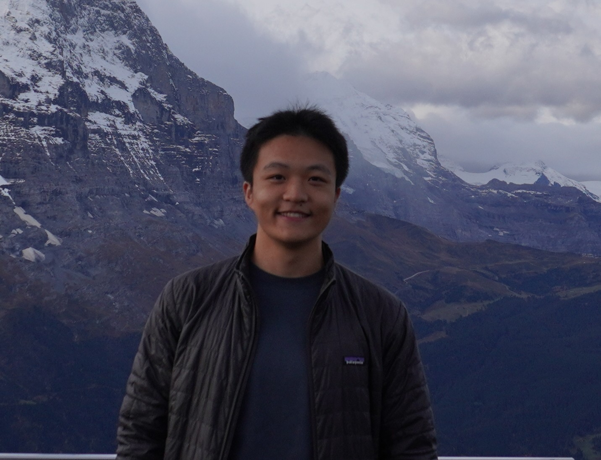
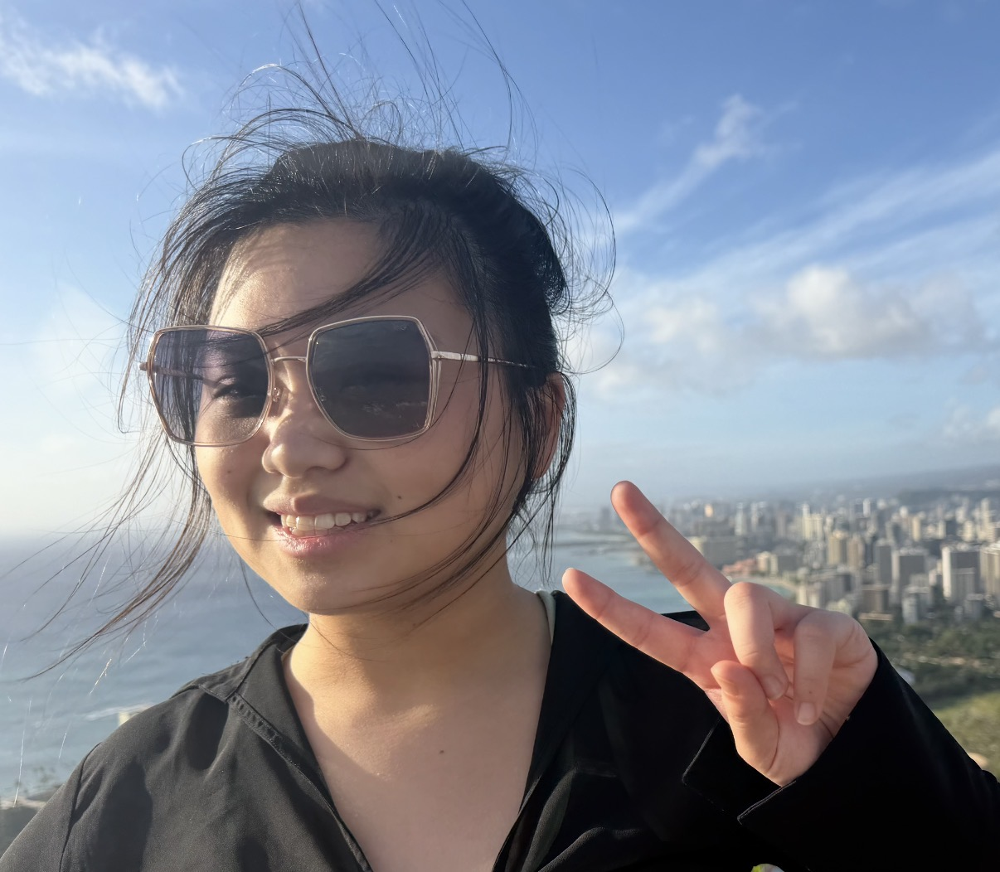
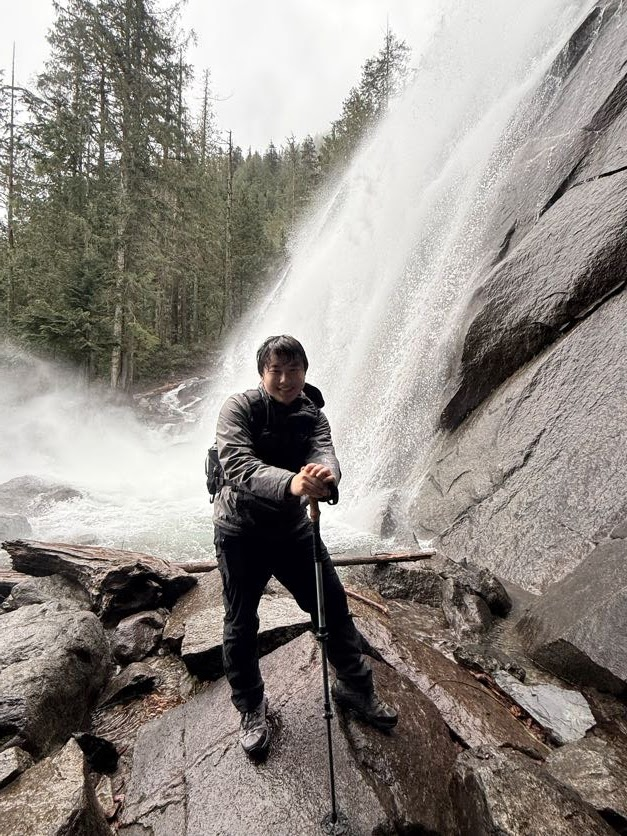
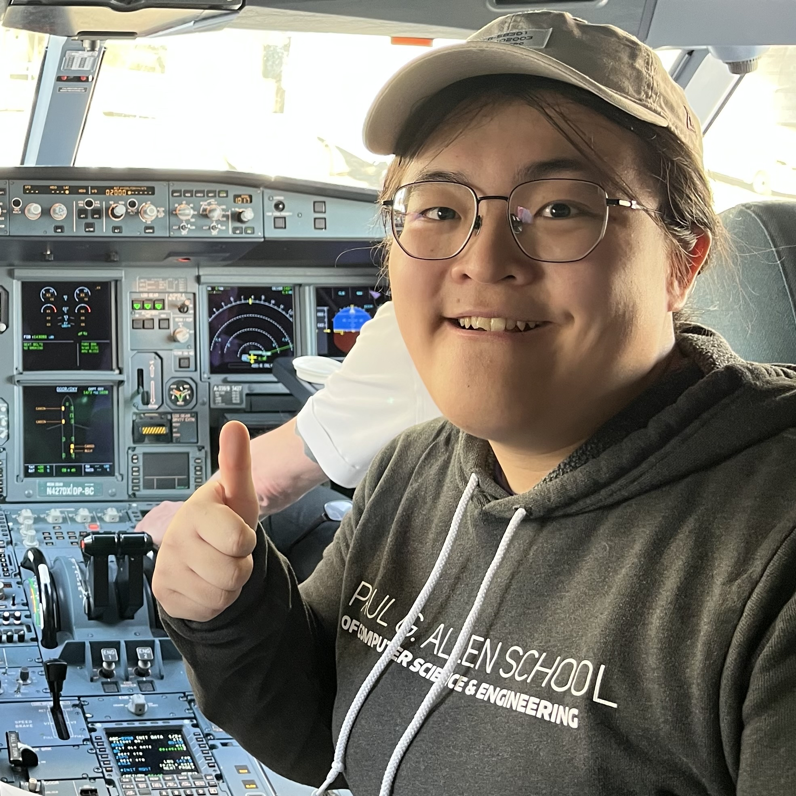
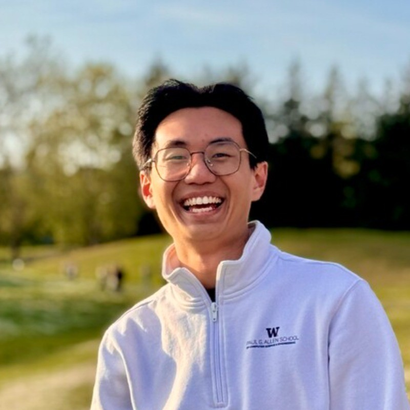
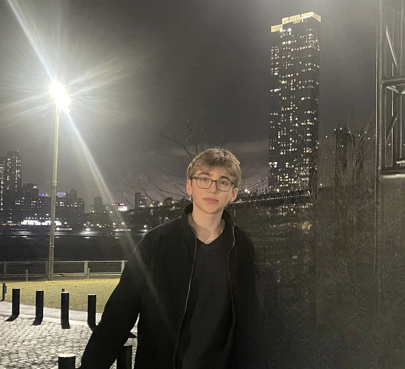
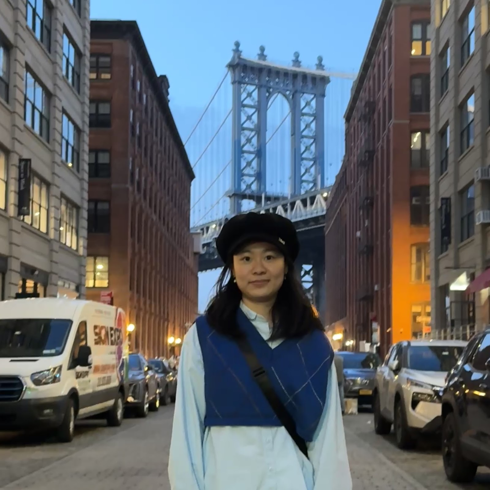

---
title: Course Staff
...

# Instructor

## Nathan Brunelle

# TAs

## Zach Bi

Hello, my name is Zachary. I’m a current Junior studying CS: DS and I’ve TAed a lot, but this is my first time doing the major version of DSA. I used to do a lot of Leetcode and working out but I dropped all my hobbies to prioritize sleeping, working on my car, and playing badminton weekly. I look forward to a great quarter with y’all.  

## Masa Nakura

Hi, I'm Masa! I'm a 4th year BS/MS student. In my free time, I enjoy playing and watching soccer, trying out new food, and spending time with friends. Looking forward to meeting everyone!

## Kabir Rajkotia

Hi! I’m Kabir, a junior majoring in Computer Science at UW. Outside coursework, I enjoy playing the drums, board games and getting outdoors for the occasional hike. Looking forward to meeting you all this quarter!

## Michael Whitmeyer

Hi, my name is Michael, and I am a PhD student studying complexity. I am very passionate about teaching, especially math and theoretical computer science, and I hope to make that into a career after my PhD. Outside of that, I love to climb and play board games. Looking forward to meeting you all, and feel free to reach out about anything!

## Merav Frank

Hey, I’m Merav! I’m in my junior year and I’m majoring in computer science. This is my 6th quarter as a TA (but my first in CSE 332). Outside of school I love hiking, baking (especially brownies), and going to the beach whenever its warm enough. I’m excited to meet all of you throughout the quarter and feel free to reach out to me anytime! 

## Vicky Ye

Hi everyone! I'm Vicky, a second-year Computer Science major. I'll be one of your TAs this quarter :D. Outside of classes, I enjoy skiing, playing games (lately Clair Obscur E33), making playlists, doodling, and going on little spontaneous outdoor adventures. Looking forward to learning and working with you all this quarter! 🧡

## Albert Du

Hi friends! I'm Albert, a second year CS student and second time TA. These days, you might catch me reading about urban planning or finding new shortcuts around campus. I'm excited to meet everyone! Feel free to reach out or drop by my office hours to chat!

## Jacklyn Cui

I'm Jacklyn! It was great to serve as a fifth-time TA for one of my favorite (and personally considered the most important) courses at the Allen School! Apart from doing Accessibility and HCI-related research, I also enjoy traveling and outdoor activities! Feel free to ping me if you have good recs on where to travel!

## Zhi Yang Lim

Hi! I'm Zhi Yang (Lim), fifth-year master's student, and I'm from Malaysia. This will be my 9th quarter TAing but second for 332. Outside of school, you will probably see me bouldering at SBP or playing badminton/table tennis at the IMA. I used to run a small YouTube channel solving Leetcode problems (RIP for now, but maybe a resurrection is in the cards!). Looking forward to meeting everyone!

## Andrew Leffingwell

Hello! This is my second year at UW and I am very excited to TA CSE 332. Outside of coursework, I enjoy running, backpacking, and exploring Seattle. I also really enjoy playing board games and watching sports.

## Ben Bioren

Hi, I'm Ben! I'm a junior studying Computer Science and Math. Apart from doing robotics and medicine related research, I love skiing and playing soccer. Always feel free to reach out with any questions or concerns. I'm excited to meet everyone this quarter!

## Rubee Zhao

Hello everyone! I am Rubee majoring in CS and Math. I come from Beijing and this is my fourth time teaching this course! Outside school I like to crochet and listen to music. You may see me in CS labs all the time during school days. Feel free to reach out to me if you have any questions and looking forward to see you all!

## Tony Wu

Hello! I'm Tony, a third year majoring in CS, and this is my second time as a 332 TA. In my free time, I like playing soccer and looking at maps. If you have any questions, please don't hesitate to reach out to me. Looking forward to meeting everyone!

## Hana Smahi

Hello there! I'm Hana and I'm excited to be back for my sixth quarter as a 332 TA. Outside of computer science, I love reading and being outdoors. Please don't hesitate to reach out or stop by office hours whether it's a course related question or sharing good reads/hike spots (and there may be candy...not a bribe...). Looking forward to meeting you all!
