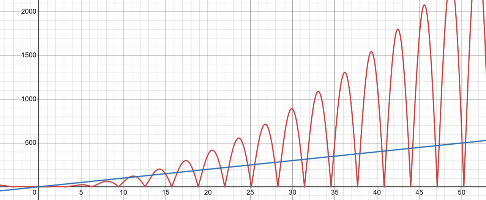

---
title: Topic Summary - Asymptotic Notation
...

# Introduction

In our [last topic summary](runningtime.html) we discussed why and how we represent running times as a function and gave high level descriptions of the tools we could use to compare those functions. To give a brief refresher:

- If we want to say that some function $f(n)$ is "less than or equal to" another function $g(n)$, we'll write $f(n)\in O(g(n))$ or $f(n)=O(g(n))$ (the former is more correct in terms of notation, but the latter is more commonly used). This is read as "$f(n)$ is big-oh of $g(n)$".
- If we want to say that some function $f(n)$ is "greater than or equal to" another function $g(n)$, we'll write $f(n)\in \Omega(g(n))$ or $f(n)=\Omega(g(n))$ . This is read as "$f(n)$ is big-omega of $g(n)$".
- If we want to say that some function $f(n)$ is "asymptotically equal to" another function $g(n)$, we'll write $f(n)\in \Theta(g(n))$ or $f(n)=\Theta(g(n))$ . This is read as "$f(n)$ is big-theta of $g(n)$".

In all of these cases, we want to be comparing functions in the way we saw them in our prior courses (CSE 123, CSE 143, or equivalent). That is, we want our definitions to allow us to compare functions by dropping non-dominant terms, ignoring constants, and then looking only at long-term behavior. This means we would compare $f(n)=11n^2-20n+8$ with $g(n)=\frac{n^3}{10} - 50$ by simplifying $f(n)$ to be $f(n)\approx n^2$ and simplifying $g(n)$ to be $g(n)\approx n^3$, thus concluding that $f(n)=O(g(n))$ or $g(n)=\Omega(f(n))$.

This is the process we want to end up with, but we need definitions that formalize this. This is because we want to be able to use this process even when the functions are not so easy to compare. For example, this process still makes it unclear how we would compare $f(n) = (\log n)^2$ with $g(n)=\sqrt n$.

# O, $\Omega$, $\Theta$

We now will present the formal definitions of $O$, $\Omega$, and $\Theta$, and discuss why they result in the comparison process above.

Firstly, let's talk about what *type* of thing $O$, $\Omega$, and $\Theta$ are. When we look $O(n)$, $\Omega(n)$, and $\Theta(n)$, these each are actually a *set of functions*, specifically: 

- **$O(n)$ is the set of all functions which are asymptotically upper bounded by $g(n)=n$**. 

    - Some examples of functions that belong to this set are $n$, $2n$, $0.5\cdot n$, $\sqrt n$, $1$, $\log n$, etc.

- **$\Omega(n)$ is the set of all functions which are asymptotically lower bounded by $g(n)=n$**. 

    -  Some examples of functions that belong to this set are $n$, $2n$, $0.5 \cdot n$, $n^2$, $n \log n$, $2^n$, etc.

- **$\Theta(n)$ is the set of all functions which are asymptotically tight bounded by $g(n)=n$**.

    - Some examples of functions that belong to this set are $n$, $2n$, $0.5 \cdot n$, $n-5$, etc.

(Totally optional aside if you want to geek out about math notation with me for a bit. The formal type of $O$, $\Omega$, $\Theta$ themselves is something like "functions mapping functions to sets of functions", and we could write their type as $(\mathbb{N} \rightarrow \mathbb{N}) \rightarrow \mathcal{P}(\mathbb{N} \rightarrow \mathbb{N})$ which would read something like "a function whose domain is functions mapping natural numbers to natural numbers and whose co-domain is the powerset of functions mapping natural numbers to natural numbers".)

## Formal Definitions

Here we present the formal definitions of $O$, $\Omega$, and $\Theta$:

- We define $f(n) \in O(g(n))$ provided that $\exists c>0$ and $\exists n_0\in \mathbb{N}$ such that $\forall n \geq n_0$ it is true that $f(n)\leq c \cdot g(n)$.
- We define $f(n) \in \Omega(g(n))$ provided that $\exists c>0$ and $\exists n_0\in \mathbb{N}$ such that $\forall n \geq n_0$ it is true that $f(n)\geq c \cdot g(n)$.
- We define $f(n) \in \Theta(g(n))$ provided that $f(n)\in O(g(n))$ and $f(n)\in \Omega(g(n))$.

## Intuition

Let's now discuss the intuition for how these definitions give us some of the properties we've mentioned to be desirable.

### Achieving greater than, less than, and equal to

We mentioned that $f(n)\in O(g(n))$ acts like "$f(n) \leq g(n)$", $f(n)\in \Omega(g(n))$ acts like "$f(n) \geq g(n)$", and $f(n)\in \Theta(g(n))$ acts like "$f(n) \approx g(n)$". Here's where we can see these relationships in the formal definitions:

- **$O$**: Ignoring all of the quantifiers for now, we see that the definition of $O$ concludes with $f(n)\leq c \cdot g(n)$. We are therefore checking that the value of $f(n)$ is less than or equal to $g(n)$, directly corresponding to that intuitive notion.
- **$\Omega$**: Ignoring all of the quantifiers for now, we see that the definition of $\Omega$ concludes with $f(n)\geq c \cdot g(n)$. We are therefore checking that the value of $f(n)$ is greater than or equal to $g(n)$, directly corresponding to that intuitive notion.
- **$\Theta$**: we say that $f(n)\in \Theta(g(n))$ provided it is both $O(g(n))$ and $\Omega(g(n))$. Mapping back to the intuitions of $O$ and $\Omega$ this means "$f(n) \leq g(n)$" and "$f(n) \geq g(n)$" respectively. Similar to when we're comparing numbers, the only way that something can be both $\leq$ and $\geq$ another thing is if they are equal. *(Important, because of the way we're comparing, we're not saying that $f(n)$ and $g(n)$ give the same output, just that in the long term their outputs are of similar magnitude.)*

### Ignoring Small Inputs

Another property we mentioned that these definitions should have is that they ignore small inputs. This was important because we might have an algorithm which is very fast for small inputs, but then scales poorly as the input size grows. In such a situation we would likely prefer the algorithm which scales better, so we hope to ignore these little input sizes.

All three of these definitions enable this in the same way. Each definition has the requirement that $\exists n_0\in \mathbb{N}$. We can interpret this $n_0$ (pronounced "n sub zero" or "n naught") as the size where we stop ignoring. In other words, we're going to ignore all input sizes smaller than this chosen value $n_0$. The definitions enforce this ignoring by conditioning $f(n)\leq c \cdot g(n)$ and $f(n)\geq c \cdot g(n)$ on $n \geq n_0$. In other words, the definitions only need the target inequality to hold for values of $n$ that are larger than $n_0$, all the smaller values are ignored.

### Dropping Constants and Non-Dominant Terms

We want our definitions to have the property that constant coefficients and non-dominant terms have no impact on the asymptotic growth. In other words, we want a function like $\frac{1}{5}n^2-13n-8$ to be considered asymptotically the same as $20n^2 + 100n + 500$. This behavior is accomplished using the constant value $c$ in the definition.

Let's first look at how $c$ allows us to ignore constant coefficients. Suppose we want to compare $f(n)=5n^3$ to $g(n)=2n^3$. Because our definition of $O$ allows us to multiply $g(n)$ by a $c$, we could pick $c=3$ to conclude $f(n)\leq c \cdot g(n)$, since we would have $5 n^3 \leq 3 \cdot 2 n^3$ and so $f(n)=O(g(n))$. Using the choice of $c=1$ we could show $f(n)= \Omega(g(n))$ since we would have $5n^3 \geq 2n^3$. Together, this means that $f(n)=\Theta(g(n))$. From these examples, we can see that two functions that differ only by a constant coefficient can be shown to grow at the same asymptotic rate using the constant $c$ in the definition. For this reason, we are able to ignore constant coefficients in asymptotic analysis.

Next let's see how $c$ allows us to ignore non-dominant terms. Intuitively, what we'll see is that adding a non-dominant term makes *less* of a difference asymptotically than changing a constant coefficient on the dominant term. Therefore, since we understand that we can ignore constant coefficients, we can also ignore non-dominant terms. 

Let's see an example of this. Suppose we want to compare $f(n)=2n^2 + 8n + 3$ with $g(n)=n^2$. Let's start by showing that $f(n)=O(g(n))$. To do this we need $f(n)\leq c \cdot g(n)$. To help ourselves out, we'll first identify a new function $f'(n)$ such that $f(n)\leq f'(n)$ and $f'(n)$ differs from $g(n)$ by only a constant coefficient. Let's start with $f(n)=2n^2 + 8n + 3$. For any value of $n \geq 1$ $n^2 \geq n$ and $n^2 \geq 1$ so $2n^2 + 8n + 3 \geq 2n^2 + 8n^2 + 3n^2$ and so $f(n)\leq 13n^2. We can now use $f'(n)=13n^2$, and since that differs from $g(n)$ by only a constant factor, we can conclude $f(n)=O(g(n))$.

Let's now show $f(n)=\Omega(g(n))$ for $f(n)=2n^2 + 8n + 3$ and $g(n)=n^2$. In this case we need $f(n) \geq g(n)$, so for our choice of $f'(n)$ we want $f(n)\geq f'(n)$ and we want $f'(n)$ to differ from $g(n)$ by only a constant factor. In this case we can select $f'(n)=2n^2$ by just dropping the non-dominant terms since they only could increase the value.

# Example Proofs

Now that we've seen how our definitions operate, let's see some example proofs of $O$, $\Omega$ and $\Theta$. The definitions of $O$ and $\Omega$ require showing that there exists values $c$ and $n_0$ which cause the statements $\forall n \geq n_0 . f(n)\leq c \cdot g(n)$ (for $O$) or $\forall n \geq n_0 . f(n)\geq c \cdot g(n)$ (for $\Omega$) to be true. Therefore a complete proof only needs to prove any one choice of $c$ paired with $n_0$, then demonstrate the target inequality holds for every value of $n$ that's at least $n_0$. The important thing to note is that you do not need to justify how or why you selected your $c$ and $n_0$ pair, you just need to defend that they work. In the examples below we'll show you how I (Nathan) would go about identifying the pair, then I'll show you how I would prove that my choice works.

## "Squeeze Method"

In all examples we will show one way we might approach identifying $c$ and $n_0$ that we are calling the "squeeze method". For the squeeze method, instead of directly comparing $f(n)$ with $c\cdot g(n)$, we will instead identify a third function that we might call $f'(n)$. 
We want this new function $f'(n)$ to be "squeezed" between $f(n)$ and $c\cdot g(n)$, but is easier to compare to both. For example, for $O$ proofs, we want $f(n) \leq f'(n) \leq c\cdot g(n)$, and for it to be easier to compare $f(n)$ with $f'(n)$ and $f'(n)$ with $c\cdot g(n)$.

Observe that this squeeze method is mostly an approach for how we approach the problem on our "scratch paper", but may not show up when we write out our proofs.

### Big-Oh Proofs - "Squeeze Method"

For each of these we'll show $f(n)=O(g(n))$ for different choices of $f(n)$ and $g(n)$. 

#### $f(n)=4n^2 + 8n + 10$, $g(n)=\frac{1}{4} n^3$

> **Nathan's scratch paper**
> Because we're showing $O$, we want $f(n)\leq c \cdot g(n)$. Comparing the two functions, $g(n)$ seems to have the larger dominant term, so my strategy will be to identify a function $f'(n)$ where it's clear that $f(n) \leq f'(n)$ and $f'(n)\leq g(n)$. Specifically, I will pick $f'(n)$ to have the form $k n^2$ so that it will be easy to compare $f(n)$ with $f'(n)$ and easy to compare $f'(n)$ with $g(n)$. Because for any value of $n\geq 1$ we have $n^2\geq n$ (multiply both sides by $n$) and $n^2 \geq 1$ (combine the previous two expressions) I can pick $f'(n)=22n^2$, because it's clear that $4n^2 + 8n + 10 < 22n^2$ (by substituting $8n^2$ for $8n$ and $10n^2$ for $10$). 
> 
>Now we need to get $f'(n)\leq c\cdot g(n)$. We could take two strategies to do this. We could either try to select an $n_0$ so that $c\cdot g(n)$ "overtakes" $f'(n)$, or we could select a value of $c$ so that this becomes true for all choices of $n$ (or we could mix these). To me, it seems easier to select $c$, so I'll go with that. Since the coefficient within $f'(n)$ is $22$ and the coefficient in $g(n)$ is $\frac{1}{4}$, I'll pick $c=88$ so that $c\cdot g(n)=22n^3$, making it clearly larger than $f'(n)$ and therefore larger than $f(n)$.

Now we have our selection of $n_0=1$ and $c=88$. Let's use those to show $f(n)= O(g(n))$.

> **Proof**: $f(n) = O(g(n))$
> By definition of $O$, it's sufficient to show $\forall n \geq n_0 . f(n)\leq c \cdot g(n)$ for a choice of $c>0$ and $n_0$. Let $n_0=1$ and $c=88$. We now need to show that whenever $n\geq 1$ we have that $4n^2+8n+10 \leq 88\cdot \frac{1}{4} n^3$. Observe that for $n \geq 1$ we have that $n^2 \geq 1$ and also $n^2 \geq n$. therefore $4n^2 + 8n + 10 \leq 4n^2 + 8n^2 + 10n^2 = 22n^2$. We can also see for $n\geq 1$ that $n^3 \geq n^2$ and so $22n^2 \leq 22n^3 = g(n)$. Therefore we have $f(n)\leq c\cdot g(n)$, and we can conclude $f(n) = O(g(n))$.

#### $f(n)=4n^2 - 8n + 10$, $g(n)= 2n^2$

> **Nathan's scratch paper**
> Because we're showing $O$, we want $f(n)\leq c \cdot g(n)$. We can't exactly use the same strategy as before to convert all pieces $f(n)$ to like terms because we're subtracting $8n$ (the argument we used above to do this relied on the fact that replacing $n^2$ gave us a larger value, but replacing $n^2$ for $n$ here gives us a smaller value). But keeping in mind that if $f(n) \leq f'(n)$ and $f'(n)\leq c\cdot g(n)$, it's sufficient to substitute $f(n)$ with something larger. In this case, we can just drop the $-8n$ since it only makes $f(n)$ smaller. In other words, it will be good enough to show $4n^2+10 \leq c \cdot g(n)$. Now we can use the same trick as the previous example, and let $c=14$ with $n_0=1$.

Now we have our selection of $n_0=1$ and $c=14$. Let's use those to show $f(n)= O(g(n))$.

> **Proof**: $f(n) = O(g(n))$
> By definition of $O$, it's sufficient to show $\forall n \geq n_0 . f(n)\leq c \cdot g(n)$ for a choice of $c>0$ and $n_0$. Let $n_0=1$ and $c=14$. We now need to show that whenever $n\geq 1$ we have that $4n^2-8n+10 \leq 14\cdot 2 n^2$. Because $4n^2-8n+10 \leq 4n^2+10$, it's sufficient to show $4n^2+10 \leq 14\cdot 2 n^2$. We proceed by algebra:
> $4n^2+10 \leq 14\cdot 2 n^2$
> $4n^2+10 \leq 28 n^2$
> $10 \leq 24n^2$
> The last expression is true for all $n>1$ because $10 \leq 24(1)^2$, and the right hand side increases with $n$ whereas the left hand side is constant.
> Therefore we have $f(n)\leq c\cdot g(n)$, and we can conclude $f(n) = O(g(n))$.

Notice for this last proof that exactly the same argument would have worked with $c=5$. For the sake of the proof, though, we don't care which choices of $c$ and $n_0$ are used so long as they're successful. If you want to try to fine the smallest choices, you're welcome to, but all we care about is a successful proof.

### Big-Omega Proofs - "Squeeze Method"

Next we'll show $f(n)=\Omega(g(n))$. These proofs will operate in exactly the same way, we just need our inequality to face the opposite direction. In other words, we want $f(n) \geq f'(n) \geq c\cdot g(n)$,

#### $f(n)=4n^2 - 8n + 10$, $g(n)= 2n^2$

> **Nathan's scratch paper**
> Because we're showing $\Omega$, we want $f(n)\geq c \cdot g(n)$. Let's try to use the strategy we applied before, which is to get more things into like terms while only making $f(n)$ smaller. In this case, dropping the $10$ makes it smaller, so we now have $4n^2-8n$. Now we *could* try to just replace $n$ with $n^2$ since that would make the expression smaller ($-8n^2$ is smaller than $-8n$). However, that makes our expression negative, and the output needs to be a natural number by definition of $\Omega$. Instead, we can now use $n_0$. The insight we'll apply is that for large enough values of $n$ we can be sure that $-8n \geq -n^2$, so we can replace $4n^2-8n$ with $3n^2$ to get a smaller function. All we need to do now is figure out how large $n$ needs to be before this occurs. Here, we can use the value $8$, since once $n > 8$ multiplying by $n$ gives a larger value than multiplying by $8$.
> At this point we have that $f(n)=4n^2-8n+10 \geq 3n^2$, and clearly $3n^2 \geq 2n^2=g(n)$, so everything should work out for $c=1$ and $n_0=8$. 

> **Proof**: $f(n) = \Omega(g(n))$
> By definition of $\Omega$, it's sufficient to show $\forall n \geq n_0 . f(n)\geq c \cdot g(n)$ for a choice of $c>0$ and $n_0$. Let $n_0=8$ and $c=1$. We now need to show that whenever $n\geq 8$ we have that $4n^2-8n+10 \geq 1\cdot 2 n^2$. Certainly $4n^2-8n+10 \geq 4n^2-8n$, so it's sufficient to show $4n^2-8n \geq 2n^2$. We can proceed using algebra:
> $4n^2-8n \geq 2n^2$
> $2n^2-4n \geq n^2$
> $4n-8 \geq n$
> $3n-8 \geq 0$
> $3n \geq 8$
> Note that whenever $n\geq 8$ we have that $3n \geq 8$, so we have $f(n) \geq c\cdot g(n)$ and therefore $f(n) = \Omega(g(n))$.

Again, we could have chosen a smaller value for $n_0$ and the same proof would still work (namely, we could have chosen 3), but we don't care! Our choice was still successful!

## "By Parts" method

In these examples we will identify our $c$ and $n_0$ by comparing our functions "by parts". This approach can be used for comparing $f(n)$ to $g(n)$ where $f(n)=a(n)+b(n)$ for other functions $a$ and $b$.

This strategy uses the following observation:

If $a(n) \in O(g(n))$ for constants $c_a$ and $n_a$, and  $b(n) \in O(g(n))$ for constants $c_b$ and $n_b$, then $f(n)=a(n)+b(n)$ belongs to $O(g(n))$ for constant $c=c_a+c_b$ and $n_0=max(n_a, n_b)$.

    - **Proof**: We know that $\forall n\geq n_a$ we have that $a(n) \leq c_a \cdot g(n)$, and similarly $\forall n\geq n_b$ we have that $b(n) \leq c_b \cdot g(n)$. This means that $a(n)+b(n) \leq c_a \cdot g(n) + c_b \cdot g(n) = (c_a+c_b)\cdot g(n)$ for all values of $n$ larger than both $n_a$ and $n_b$ (i.e. larger than the $max(n_a, n_b)$). 

This means if $f(n)$ is the sum of a bunch of other functions, we can asymptotically bound $f(n)$ relative to $g(n)$ by bounding each of the components of $f(n)$. 

It's important to recognize that the this approach is most well-suited for $O$ proofs, it's less helpful for $\Omega$ proofs. Let's look at some $O$ examples first, and then see why it's not a good fit for $\Omega$.

### Big-Oh Proofs - "By Parts Method"

For each of these we'll show $f(n)=O(g(n))$ for different choices of $f(n)$ and $g(n)$. 

#### $f(n)=4n^2 + 8n + 10$, $g(n)=\frac{1}{4} n^3$

> **Nathan's scratch paper**
> Because we're showing $O$, we want $f(n)\leq c \cdot g(n)$. We can break down $f(n) = f_1(n) + f_2(n) + f_3(n)$ where $f_1(n) = 4n^2$, $f_2(n) = 8n$, and $f_3(n) = 10$. Next we find choices of $c$ and $n_0$ to show that each of $f_1(n)$, $f_2(n)$, and $f_3(n)$ belong to $O(g(n))$.
>
> To show $f_1(n) =O(\frac{1}{4}n^3)$ we need to show that $4n^2 \leq c_1 \cdot \frac{1}{4}n^3$. By applying algebra to simplify, this is equivalent to $16 \leq c_1 \cdot n$. This holds true with $c_1=1$ so long as $n \geq 16$, and so we will use $c_1=1$ and $n_1=16$ to show $f_1(n) =O(\frac{1}{4}n^3)$
>
> To show $f_2(n) = O(\frac{1}{4}n^3)$ we need to show that $8n \leq c_2 \cdot \frac{1}{4}n^3$. By applying algebra to simplify, this is equivalent to $32 \leq c_3 \cdot n^2$. This holds true with $c_2=1$ so long as $n \geq 6$, and so we will use $c_2=1$ and $n_2=32$ to show $f_3(n) =O(\frac{1}{4}n^3)$
>
> Finally, To show $f_3(n) = O(\frac{1}{4}n^3)$ we need to show that $10 \leq c_3 \cdot \frac{1}{4}n^3$. By applying algebra to simplify, this is equivalent to $40 \leq c_3 \cdot n^3$. This holds true with $c_3=40$ for all values of $n \geq 1$, and so we will use $c_3=40$ and $n_3=1$ to show $f_3(n) =O(\frac{1}{4}n^3)$
>
> We can now use the previous three results to show $f(n) = O(g(n)). for $n_0$, we will use $max(n_1, n_2, n_3)$, and so $n_0=max(16,6,1) = 16$. For $c$ we will use $c= c_1+c_2+c_3 = 1 + 1 + 40 = 42$.

Now we have our selection of $n_0=16$ and $c=42$. Let's use those to show $f(n)= O(g(n))$.

> **Proof**: $f(n) = O(g(n))$
> By definition of $O$, it's sufficient to show $\forall n \geq n_0 . f(n)\leq c \cdot g(n)$ for a choice of $c>0$ and $n_0$. Let $n_0=16$ and $c=42$. We now need to show that whenever $n\geq 32$ we have that $4n^2+8n+10 \leq 42\cdot \frac{1}{4} n^3$. To demonstrate this, we can break up $42 \cdot \frac{1}{4} n^3$ into parts, so we'll use $g(n) = (1+1+40)\frac{1}{4} n^3$. To now show $f(n) \leq c\cdot g(n)$, it's sufficient to show $4n^2 \leq \frac{1}{4} n^3$, $8n \leq \frac{1}{4} n^3$, and $10 \leq 40 \cdot \frac{1}{4} n^3$. 
>
> $4n^2 \leq \frac{1}{4} n^3 \equiv 16 \leq n$, which is true for all $n \geq n_0$
>
> $8n \leq \frac{1}{4} n^3 \equiv 32 \leq n^2$, which is true for all $n \geq n_0$
>
> $10 \leq 40 \cdot \frac{1}{4} n^3 \equiv 10 \leq 10n^3$, which is true for all $n \geq n_0$.

#### $f(n)=4n^2 - 8n + 10$, $g(n)= 2n^2$

> **Nathan's scratch paper**
> Because we're showing $O$, we want $f(n)\leq c \cdot g(n)$. We can break down $f(n) = f_1(n) + f_2(n) + f_3(n)$ where $f_1(n) = 4n^2$, $f_2(n) = -8n$, and $f_3(n) = 10$. Next we find choices of $c$ and $n_0$ to show that each of $f_1(n)$, $f_2(n)$, and $f_3(n)$ belong to $O(g(n))$.
>
> To show $f_1(n) =O(2n^2)$ we need to show that $4n^2 \leq c_1 \cdot 2n^2$. By applying algebra to simplify, this is equivalent to $2 \leq c_1$. So therefore this holds true for any $c_1\geq 2$, and for any value of $n \geq 1$. We'll use $c_1=2$ and $n_1=1$.
>
> To show $f_2(n) = O(2n^2)$ we need to show that $-8n \leq c_2 \cdot 2n^2$. Because the left hand side is negative, this is true for all values of $c_2\geq 0$ and $n_2 \geq 0$, so we'll pick $c_2=1$ and $n_1 = 0$ (since $c_2$ must be positive according to the definition of $O$).
>
> Finally, To show $f_3(n) = O(2n^2)$ we need to show that $10 \leq c_3 \cdot 2n^2$. By applying algebra to simplify, this is equivalent to $5 \leq c_3 \cdot n^2$. This holds true with $c_3=5$ for all values of $n \geq 1$, and so we will use $c_3=5$ and $n_3=1$.
>
> We can now use the previous three results to show $f(n) = O(g(n)). for $n_0$, we will use $max(n_1, n_2, n_3)$, and so $n_0=max(1,0,1) = 1$. For $c$ we will use $c= c_1+c_2+c_3 = 2 + 1 + 5 = 8$.

Now we have our selection of $n_0=1$ and $c=8$. Let's use those to show $f(n)= O(g(n))$.

> **Proof**: $f(n) = O(g(n))$
> By definition of $O$, it's sufficient to show $\forall n \geq n_0 . f(n)\leq c \cdot g(n)$ for a choice of $c>0$ and $n_0$. Let $n_0=1$ and $c=8$. We now need to show that whenever $n\geq 1$ we have that $4n^2-8n+10 \leq 8\cdot 2n^2$. To demonstrate this, we can break up $8 \cdot 2 n^2$ into parts, so we'll use $g(n) = (2+1+5)2 n^2$. To now show $f(n) \leq c\cdot g(n)$, it's sufficient to show $4n^2 \leq 2 \cdot 2 n^2$, $-8n \leq 1\cdot 2 n^2$, and $10 \leq 5 \cdot 2 n^2$. 
>
> $4n^2 \leq 2\cdot 2n^2 \equiv 4n^2 \leq 4n^2$, which is true for all $n \geq n_0$
>
> $-8n \leq \frac{1}{4} n^3$, which is true for all $n \geq n_0$ because the left hand side is negative while the right hand side is positive.
>
> $10 \leq 5 \cdot 2 n^2 \equiv 10 \leq 10n^2$, which is true for all $n \geq n_0$.

### Big-Omega Proofs - "By Parts Method"

Now let's see why it is challenging to use this method for $\Omega$. Let's look at our example from above, and see what happens when we apply the same approach with only our inequalities held.

#### $f(n)=4n^2 - 8n + 10$, $g(n)= 2n^2$

> **Nathan's scratch paper**
> Because we're showing $\Omega$, we want $f(n)\geq c \cdot g(n)$. We can break down $f(n) = f_1(n) + f_2(n) + f_3(n)$ where $f_1(n) = 4n^2$, $f_2(n) = -8n$, and $f_3(n) = 10$. Next we find choices of $c$ and $n_0$ to show that each of $f_1(n)$, $f_2(n)$, and $f_3(n)$ belong to $\Omega(g(n))$.
>
> To show $f_1(n) =\Omega(2n^2)$ we need to show that $4n^2 \geq c_1 \cdot 2n^2$. By applying algebra to simplify, this is equivalent to $2 \geq c_1$. So therefore this holds true for any $c_1\leq 2$, and for any value of $n \geq 1$. We'll use $c_1=1$ and $n_1=1$.
>
> To show $f_2(n) = \Omega(2n^2)$ we need to show that $-8n \geq c_2 \cdot 2n^2$. Because the left hand side is negative, this actually can never be done! This means we'll need to break things up differently. Forget what we did in the previous step, we'll break up $f(n)$ into $f_1(n)+f_2(n)$ where $f_1(n) = 4n^2 -8n$ and $f_2(n) = 10$. 
>
> Now let's skip to our new $f_2(n) = 10$. We'll need to show that $10 \geq c_2 \cdot 2n^2$. Notice that the left hand side is constant, wherease the right hand side is increasing. This means that the only way we could make this true is if $c_2$ is negative, which is not allowed. At this point, though, we're out of options for how to split it up, so we're right back to where we started!

The intuition here is that with asymptotic notation, only the domininant term determines the asymptotic running time. This fits in well with $O$ since the non-dominant terms of $f(n)$ should each be upper-bounded by the dominant term, which should be upper-bounded by $g(n)$, in other words, all of these inequalities are in the same direction. For $\Omega$ all of the non-dominant terms of $f(n)$ are upper-bounded by the dominant term of $f(n)$, which itself is lower bounded by $g(n)$. This means that the non-dominant terms of $f(n)$ may compare to $g(n)$ in any direction, making it so we cannot totally separate them into parts for our proof.

## "Guess and Check" or Induction Method

The last method we'll discuss uses induction. As with any proof by induction, the proof itself is very formulaic making it relatively easy to demonstrate our goal. The key downside to induction though, it is that it is really only useful for showing the answer to be correct, not for helping to find the correct answer in the first place. This is why I've dubbed this the "Guess and Check" method. For this method you'll need to first use some entirely different method to select a value of $c$ and $n_0$ (perhaps a method from above), then you can use induction to demonstrate that this method is correct.

### Big-Oh Proofs - "Guess and Check" Method

For each of these we'll show $f(n)=O(g(n))$ for different choices of $f(n)$ and $g(n)$. 

Our $O$ proofs by induction will proceed as follows:

- Base case: show that $f(n_0) \leq c \cdot g(n_0)$
- Inductive step: show that if for some $x\geq n_0$ we have $f(x) \leq c\cdot g(x)$ then $f(x+1) \leq c\cdot g(x+1)$.

Because this is guess and check, we will not show any scratchwork here. Instead, we'll just use a choice of $c$ and $n_0$ from a previous method.

#### $f(n)=4n^2 + 8n + 10$, $g(n)=\frac{1}{4} n^3$

>**Proof**
>We will apply induction to $\forall n\geq n_0$ we have $f(n) \leq c\cdot g(n)$ using $n_0=16$ and $c=42$.
>
> **Base Case:** $f(n_0) \leq c \cdot g(n_0)$
>
> We need to show $4n_0^2 + 8n_0 + 10 \leq 42 \cdot \frac{1}{4} n_0^3$. Plugging in $n_0=16$ we get $4n_0^2 + 8n_0 + 10=1162$ and $42 \cdot \frac{1}{4} n_0^3 = 43008$, and so the inequality holds.
>
>**Inductive Step: $f(x) \leq c \cdot g(x) \rightarrow f(x+1) \leq c \cdot g(x+1)$
>
> We assume $4x^2 + 8x + 10 \leq 42 \cdot \frac{1}{4} x^3$, now we wish to show $4(x+1)^2 +8(x+1) + 10 \leq 42 \cdot \frac{1}{4} (x+1)^3$. Let's begin by simplifying the left hand side.
>
> $4(x+1)^2 +8(x+1) + 10 = 4(x^2 + 2x + 1) + 8x + 8 + 10 = 4x^2 + 16x + 22$
> 
> And now the right hand side;
>
> $42 \cdot \frac{1}{4} (x+1)^3 = \frac{42}{4}(x+1)(x^2 + 2x + 1) = \frac{42}{4}(x^3 + 3x^2 + 3x + 1)$
>
> So it is sufficient to show $4x^2 + 16x + 22 \leq \frac{42}{4}(x^3 + 3x^2 + 3x + 1)$. Again, let's simplify with algebra.
>
> $4x^2 + 16x + 22 \leq \frac{42}{4}(x^3 + 3x^2 + 3x + 1)$
>
> $\equiv 16x^2 + 64x + 88 \leq 42x^3 + 126x^2 + 126x + 42$
>
> $\equiv  0 \leq 42x^2 + 110x^2 + 62x - 46$
>
> This inequality holds when $x \geq 16$ because then $110x^2 > 46$, and so the right hand side is positive. Therefore by principal of induction, $f(n) \leq c \cdot g(n)$ for all $n\geqn_0$ and thus $f(n) = O(g(n))$.

### Big-Omega Proofs - "Guess and Check" Method

To show $f(n)=\Omega(g(n))$ by induction we proceed as follows:

- Base case: show that $f(n_0) \geq c \cdot g(n_0)$
- Inductive step: show that if for some $x\geq n_0$ we have $f(x) \geq c\cdot g(x)$ then $f(x+1) \geq c\cdot g(x+1)$.

Note that this is exactly the same as the above, but with the inequality facing a different direction. Due to the similarity, we will omit examples here.

## Big-Theta Proofs

Next we'll show $f(n)=\Theta(g(n))$. To do this, we just have to do one of each of the proofs above! We need to show both that $f(n)=O(g(n))$ and $f(n)=\Omega(g(n))$. Importantly, these two proofs can be done completely independently. That is, we don't need to use the same choice of $c$ and $n_0$ for each, we can use different ones!

### $f(n)=4n^2 - 8n + 10$, $g(n)= 2n^2$

> **Proof**: $f(n) = \Theta(g(n))$
> We showed above that $f(n) = O(g(n))$ and that $f(n)=\Omega(g(n))$, therefore $f(n) = \Theta(g(n))$.

# Common Misconceptions

There are many misconceptions that pop up with $O$, $\Omega$, and $\Theta$, and many of these misconceptions are seeded by or reinforced by various problem solving resources that are broadly available (such as interview prep resources, etc.). Below we have a table of misconceptions, and a discussion of how to correct them.

|   Misconception   |  Discussion | 
| ----------------- | ----------- |
| $O$ means "worst case" and $\Omega$ means "best case" | This is probably *the* most common misconception. I believe that this stems from the (correct) understanding that $O$ means "less than or equal to" and $\Omega$ means "greater than or equal to". The misconception comes in, though, because of a misunderstanding of what exactly we're comparing. When using $O$ and $\Omega$ we're comparing two functions, not necessarily two running times. So if we say that the worst case running time of our algorithm is $O(n)$ we're saying "The function which we identified using a worst case runtime analysis is asymptotically upper bounded by the function $g(n)=n$." We are not saying "the algorithm takes up to linear time to run". As such, it totally makes sense to say something like "the best case running time of this algorithm is $O(n)$" because in that case we're saying that we performed a best case analysis on the algorithm, arrived at some function, and found that the resulting function was upper bounded by the function $g(n)=n$.
| Asymptotic analysis is the act of placing a running time into one of several "buckets" | There are relatively few running times that comprise an overwhelming majority of practical algorithms. These include constant, logarithmic, linear, log-linear, quadratic, cubic, and exponential. Those, though, are not the only running times possible. Fundamentally, asymptotic analysis is a tool for comparing functions. As such, we can define $O(g(n))$ for *any* function $g(n)$. For example, $O(2n)$ totally makes sense (it just so happens to be the same set as $O(n)$), as does $O(n^{(\log n)^2})$.
| Either $f(n)=O(g(n))$ or $f(n)=\Omega(g(n))$ | Earlier we drew an analogy between asymptotic analysis of functions and comparisons of numbers when we discussed the intuition for the definition of $\Theta$. There are some ways, though, where the comparisons of functions behave in ways that are quite different from comparisons of numbers. For example, for any pair of numbers $x$ and $y$ at least one of the following statements will be true: $x \geq y$ or $x \leq y$. The same cannot be said of comparing functions. That is, we can find functions $f(n)$ and $g(n)$ such that neither $f(n)=O(g(n))$ nor $f(n)=\Omega(g(n))$.  For example, we can consider $f(n)= |n^2 \sin(n)|$ and $g(n)=n$. For these functions, there is never any point where one function is forevermore greater that the other. This is because $|\sin(n)|$ is always going to be continuously moving between $0$ and $1$, making $f(n)$ continuously moving between $0$ and $n^2$. This means that for any choice of $n_0$ and any choice of $c>0$ we'll be able to find a value of $n>n_0$ such that $f(n)>c\cdot g(n)$ (e.g. an input where $|\sin(n)|\approx 1$) and one such that $f(n)<c \cdot g(n)$ (e.g. an input where $|\sin(n)|\approx 0$). To provide a visual for how this could be the case, see the graph below, which plots $|n^2 \sin(n)|$ and $10n$.  